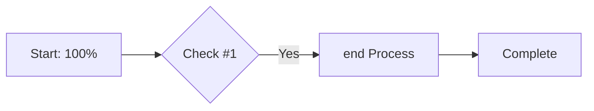

# SharePoint File Upload GitHub Action

> 🚀 Automatically sync files from GitHub to SharePoint with intelligent change detection and Markdown-to-HTML conversion

[](https://opensource.org/licenses/MIT)
[](https://github.com/AunalyticsManagedServices/sharepoint-file-upload-action)

## 📋 Table of Contents

- [Overview](#overview)
- [Key Features](#key-features)
- [Quick Start](#quick-start)
- [Configuration](#configuration)
  - [Required Parameters](#required-parameters)
  - [Optional Parameters](#optional-parameters)
  - [File Glob Patterns](#file-glob-patterns)
  - [Exclusion Patterns](#exclusion-patterns)
- [Usage Examples](#usage-examples)
- [Advanced Features](#advanced-features)
  - [Smart Sync](#smart-sync)
  - [Markdown Conversion](#markdown-conversion)
- [Security Considerations](#security-considerations)
  - [Sites.Selected Setup](#sitesselected-setup)
- [Troubleshooting](#troubleshooting)
- [Contributing](#contributing)

## Overview

This GitHub Action provides file synchronization between GitHub repositories and SharePoint document libraries. It intelligently uploads only changed files, converts Markdown documentation to SharePoint-friendly HTML, and provides detailed sync statistics.

### Why Use This Action?

- **📁 Automated Documentation Sync**: Keep your SharePoint documentation in sync with your GitHub repository
- **⚡ Efficient Updates**: Only uploads new or modified files, saving time and bandwidth
- **📝 Markdown Support**: Automatically converts `.md` files to styled HTML with Mermaid diagram support
- **🔄 Reliable**: Includes retry logic and comprehensive error handling
- **📊 Detailed Reporting**: Shows exactly what was uploaded, skipped, or failed

## Key Features

| Feature | Description |
|---------|-------------|
| **Smart Sync** | Uses xxHash128 content hashing (or file size) to skip unchanged files |
| **Markdown → HTML** | Converts `.md` files to beautifully styled HTML for SharePoint viewing |
| **Mermaid Diagrams** | Renders Mermaid flowcharts/diagrams as embedded SVG |
| **Batch Upload** | Handles multiple files and maintains folder structure |
| **Large File Support** | Automatically uses chunked upload for files >4MB |
| **Special Character Handling** | Sanitizes filenames for SharePoint compatibility |

## Quick Start

### 1. Set Up SharePoint App Registration

Your SharePoint administrator needs to:
1. Register an app in Azure AD
2. Grant permissions (choose one approach):

   **Option A: Site-Specific Access (Recommended - Most Secure)** ✅
   - Grant `Sites.Selected` permission
   - Explicitly grant app access to specific sites only ([see how](#sitesselected-setup))
   - Limits access to only the sites you specify

   **Option B: Tenant-Wide Access**
   - Grant `Sites.ReadWrite.All` (access to all sites in tenant)
   - Grant `Sites.Manage.All` (optional, enables automatic FileHash column creation)

3. Provide you with:
   - Tenant ID
   - Client ID
   - Client Secret

### 2. Add Secrets to GitHub

Navigate to **Settings → Security → Secrets and variables → Actions** and add:

```
SHAREPOINT_TENANT_ID
SHAREPOINT_CLIENT_ID
SHAREPOINT_CLIENT_SECRET
```

### 3. Create Workflow

Create `.github/workflows/sharepoint-sync.yml`:

```yaml
name: Sync to SharePoint
on:
  push:
    branches: [main]
  workflow_dispatch:

jobs:
  sync:
    runs-on: ubuntu-latest
    steps:
      - name: Github Checkout/Clone Repo # This is required
        uses: actions/checkout@v4 # This is required

      - name: Upload to SharePoint
        uses: AunalyticsManagedServices/sharepoint-file-upload-action@v3
        with:
          file_path: "**/*"
          host_name: "yourcompany.sharepoint.com"
          site_name: "YourSite"
          upload_path: "Shared Documents/GitHub Sync"
          tenant_id: ${{ secrets.SHAREPOINT_TENANT_ID }}
          client_id: ${{ secrets.SHAREPOINT_CLIENT_ID }}
          client_secret: ${{ secrets.SHAREPOINT_CLIENT_SECRET }}
```

## Configuration

### Required Parameters

| Parameter | Description | Example |
|-----------|-------------|---------|
| `file_path` | Files to upload (supports glob patterns) | `"**/*"` |
| `host_name` | Your SharePoint domain | `"company.sharepoint.com"` |
| `site_name` | SharePoint site name | `"TeamDocs"` |
| `upload_path` | Target folder in SharePoint | `"Shared Documents/Reports"` |
| `tenant_id` | Azure AD Tenant ID | `${{ secrets.SHAREPOINT_TENANT_ID }}` |
| `client_id` | App registration Client ID | `${{ secrets.SHAREPOINT_CLIENT_ID }}` |
| `client_secret` | App registration Client Secret | `${{ secrets.SHAREPOINT_CLIENT_SECRET }}` |

<details>
<summary><strong>📖 Parameter Details (click to expand)</strong></summary>

**`file_path`** - Which files to upload
- Supports glob patterns for flexible file selection
- Can be a single file, pattern, or wildcard
- Examples:
  - `"docs/readme.md"` - Single specific file
  - `"*.pdf"` - All PDF files in root directory
  - `"**/*.md"` - All Markdown files in all subdirectories
  - `"reports/**/*"` - Everything in the reports folder
- See [File Glob Patterns](#file-glob-patterns) for comprehensive pattern guide

**`host_name`** - Your SharePoint domain
- This is the domain part of your SharePoint URL
- **How to find it**: Open SharePoint in browser, copy the domain from the URL
- Examples:
  - Commercial: `"company.sharepoint.com"`
  - GovCloud: `"agency.sharepoint.us"`
  - Custom domain: `"sharepoint.customdomain.com"`
- ⚠️ Do NOT include `https://` or trailing paths

**`site_name`** - SharePoint site collection name
- The name of the specific SharePoint site (not the full URL)
- **How to find it**: In SharePoint URL `https://company.sharepoint.com/sites/TeamSite`, the site name is `"TeamSite"`
- Examples:
  - `"TeamSite"` - Team collaboration site
  - `"KnowledgeBase"` - Documentation site
  - `"ProjectArchive"` - Project storage site
- ℹ️ Case-sensitive in some configurations

**`upload_path`** - Target folder path in SharePoint
- The folder path where files will be uploaded (relative to the site)
- **Format**: `"DocumentLibrary/FolderPath/Subfolder"`
- Common library names:
  - `"Shared Documents"` - Default document library
  - `"Documents"` - Alternate default name
  - `"Site Assets"` - For web resources
- Examples:
  - `"Shared Documents"` - Upload to library root
  - `"Documents/Reports"` - Upload to Reports subfolder
  - `"Shared Documents/Q1/Financial"` - Multi-level path
- 📁 Folders are created automatically if they don't exist

**`tenant_id`** - Azure AD Tenant ID
- Your organization's Azure Active Directory tenant identifier
- **How to find it**:
  1. Go to [Azure Portal](https://portal.azure.com)
  2. Navigate to Azure Active Directory
  3. Copy the "Tenant ID" from the overview page
- **Format**: GUID like `12345678-1234-1234-1234-123456789abc`
- 🔒 Store in GitHub Secrets as `SHAREPOINT_TENANT_ID`

**`client_id`** - Application (client) ID
- The unique identifier for your registered Azure AD application
- **How to find it**:
  1. Go to Azure Portal → App Registrations
  2. Select your SharePoint app
  3. Copy the "Application (client) ID"
- **Format**: GUID like `87654321-4321-4321-4321-cba987654321`
- 🔒 Store in GitHub Secrets as `SHAREPOINT_CLIENT_ID`

**`client_secret`** - Application client secret
- The secret value (password) for authenticating your application
- **How to create it**:
  1. Go to Azure Portal → App Registrations → Your App
  2. Navigate to "Certificates & secrets"
  3. Click "New client secret"
  4. Copy the **Value** (not the Secret ID)
- ⚠️ **CRITICAL**: Copy the secret value immediately - you cannot retrieve it later
- 🔒 Store in GitHub Secrets as `SHAREPOINT_CLIENT_SECRET`
- ⏰ Secrets expire - set a reminder to renew before expiration

</details>

### Optional Parameters

| Parameter | Default | Description |
|-----------|---------|-------------|
| `file_path_recursive_match` | `false` | Enable recursive glob matching |
| `max_retries` | `3` | Number of upload retry attempts |
| `force_upload` | `false` | Skip change detection, upload all files |
| `convert_md_to_html` | `true` | Convert Markdown files to HTML |
| `exclude_patterns` | `""` | Comma-separated exclusion patterns (see [Exclusion Patterns](#exclusion-patterns)) |
| `login_endpoint` | `"login.microsoftonline.com"` | Azure AD login endpoint |
| `graph_endpoint` | `"graph.microsoft.com"` | Microsoft Graph API endpoint |

<details>
<summary><strong>📖 Parameter Details (click to expand)</strong></summary>

**`file_path_recursive_match`** - Enable recursive directory traversal
- **Default**: `false` (only matches files in specified directory)
- **When to use `true`**: To include all subdirectories in your pattern
- Examples:
  ```yaml
  # Without recursive (false):
  file_path: "docs/*"        # Only files directly in docs/

  # With recursive (true):
  file_path: "docs/**/*"     # All files in docs/ and subdirectories
  file_path_recursive_match: true
  ```
- 💡 **Tip**: Use `**/*` pattern with `recursive: true` to upload entire directory trees

**`max_retries`** - Upload retry attempts
- **Default**: `3` attempts
- **Range**: 1-10 retries recommended
- **When to adjust**:
  - Increase for unstable networks: `max_retries: 5`
  - Decrease for faster failures: `max_retries: 1`
- Each retry uses exponential backoff (2, 4, 8 seconds...)
- Examples:
  ```yaml
  max_retries: 5    # More resilient to network issues
  max_retries: 1    # Fail fast for CI/CD pipelines
  ```

**`force_upload`** - Skip smart sync change detection
- **Default**: `false` (smart sync enabled - only upload changed files)
- **When to use `true`**:
  - First-time sync to SharePoint
  - After changing file metadata/structure
  - To intentionally re-upload everything
  - Troubleshooting sync issues
- ⚠️ **Warning**: `true` uploads ALL files regardless of changes (slower, uses more bandwidth)
- Examples:
  ```yaml
  force_upload: false   # Smart sync (recommended) - skip unchanged files
  force_upload: true    # Force all files to upload
  ```
- 💰 **Performance impact**: Smart sync can skip 60-90% of files, saving significant time

**`convert_md_to_html`** - Markdown-to-HTML conversion
- **Default**: `true` (automatically convert `.md` files)
- **Output**: Styled HTML with GitHub-flavored formatting and Mermaid diagrams as SVG
- **When to use `false`**:
  - SharePoint has Markdown preview capability
  - You want raw `.md` files in SharePoint
  - Converting other file types that conflict
- Examples:
  ```yaml
  convert_md_to_html: true   # Upload README.md as README.html (styled)
  convert_md_to_html: false  # Upload README.md as-is
  ```
- 📊 Converted HTML includes embedded diagrams, syntax highlighting, and tables

**`exclude_patterns`** - Filter out unwanted files
- **Default**: `""` (no exclusions)
- **Format**: Comma-separated list of patterns
- **Common use cases**:
  - Remove build artifacts: `"*.pyc,dist,build"`
  - Exclude temp files: `"*.tmp,*.log,*.bak"`
  - Skip dependencies: `"node_modules,vendor"`
  - Hide sensitive data: `".env,secrets.json"`
- See [Exclusion Patterns](#exclusion-patterns) for detailed guide
- Examples:
  ```yaml
  exclude_patterns: "*.log,*.tmp"                    # Exclude log and temp files
  exclude_patterns: "__pycache__,node_modules,.git"  # Exclude common directories
  ```

**`login_endpoint`** - Azure AD authentication endpoint
- **Default**: `"login.microsoftonline.com"` (Commercial cloud)
- **When to change**: Using government or sovereign clouds
- **Common endpoints**:
  - US Government: `"login.microsoftonline.us"`
  - Germany: `"login.microsoftonline.de"`
  - China (21Vianet): `"login.chinacloudapi.cn"`
- Examples:
  ```yaml
  # US Commercial (default)
  login_endpoint: "login.microsoftonline.com"

  # US Government GCC High
  login_endpoint: "login.microsoftonline.us"
  ```

**`graph_endpoint`** - Microsoft Graph API endpoint
- **Default**: `"graph.microsoft.com"` (Commercial cloud)
- **When to change**: Using government or sovereign clouds (must match `login_endpoint`)
- **Common endpoints**:
  - US Government: `"graph.microsoft.us"`
  - Germany: `"graph.microsoft.de"`
  - China (21Vianet): `"microsoftgraph.chinacloudapi.cn"`
- Examples:
  ```yaml
  # US Commercial (default)
  graph_endpoint: "graph.microsoft.com"

  # US Government GCC High
  login_endpoint: "login.microsoftonline.us"
  graph_endpoint: "graph.microsoft.us"
  ```
- ⚠️ **Important**: Login and Graph endpoints must be from the same cloud environment

</details>

### File Glob Patterns

Understanding glob patterns helps you select exactly which files to upload:

| Pattern | Description | Example Matches |
|---------|-------------|-----------------|
| `*.pdf` | All PDF files in root directory | `report.pdf`, `guide.pdf` |
| `**/*.pdf` | All PDF files in any directory | `docs/report.pdf`, `archive/2024/guide.pdf` |
| `docs/*` | All files directly in docs folder | `docs/readme.md`, `docs/config.json` |
| `docs/**/*` | All files in docs and subfolders | `docs/api/spec.yaml`, `docs/guides/intro.md` |
| `**/*.{md,txt}` | All markdown and text files | `readme.md`, `notes.txt`, `docs/guide.md` |
| `**/*` | All files, subfolders, and subfiles | `All files and folders` |
| `!**/*.test.*` | Exclude test files | Excludes `file.test.js`, `spec.test.md` |

#### Glob Pattern Tips

- **`*`** matches any characters within a single directory level
- **`**`** matches zero or more directory levels
- **`{a,b}`** matches either pattern a or b
- **`!pattern`** excludes files matching the pattern
- Always use forward slashes (`/`) even on Windows

### Exclusion Patterns

Use the `exclude_patterns` parameter to skip specific files or directories during sync. This is useful for excluding temporary files, build artifacts, or sensitive data.

#### How to Specify Exclusions

Provide a **comma-separated list** of patterns:

```yaml
exclude_patterns: "*.log,*.tmp,__pycache__,node_modules,.git"
```

#### Supported Pattern Types

| Pattern Type | Example | What It Excludes |
|--------------|---------|------------------|
| **File Extension** | `*.log` | All `.log` files anywhere |
| **Exact Filename** | `config.json` | Files named exactly `config.json` |
| **Directory Name** | `__pycache__` | Any `__pycache__` directory |
| **Path Component** | `node_modules` | Any path containing `node_modules` |
| **Wildcard** | `temp*` | Files starting with `temp` |
| **Multiple Extensions** | `*.pyc,*.pyo` | Both `.pyc` and `.pyo` files |

#### Pattern Matching Rules

- **Basename matching**: Patterns match against the filename (e.g., `*.tmp` matches `file.tmp`)
- **Path component matching**: Directory names match anywhere in path (e.g., `node_modules` excludes `src/node_modules/file.js`)
- **Case sensitivity**: Matches are case-sensitive on Linux, case-insensitive on Windows
- **Auto-wildcard**: Extension-only patterns auto-expand (e.g., `log` becomes `*.log`)

#### Common Exclusion Examples

**Python Projects:**
```yaml
exclude_patterns: "*.pyc,*.pyo,__pycache__,.pytest_cache,.mypy_cache,*.egg-info"
```

**Node.js Projects:**
```yaml
exclude_patterns: "node_modules,*.log,dist,build,.cache"
```

**Build Artifacts:**
```yaml
exclude_patterns: "*.dll,*.exe,*.so,*.dylib,bin,obj"
```

**Temporary & Hidden Files:**
```yaml
exclude_patterns: "*.tmp,*.bak,.DS_Store,Thumbs.db,.git,.gitignore"
```

**Sensitive Data:**
```yaml
exclude_patterns: ".env,.env.local,secrets.json,*.key,*.pem"
```

## Usage Examples

### Example 1: Upload All Files and Folders 

```yaml
- name: Github Checkout/Clone Repo # This is required
  uses: actions/checkout@v4 # This is required

- name: Sync All Files and Folders
  uses: AunalyticsManagedServices/sharepoint-file-upload-action@v3
  with:
    file_path: "**/*"
    file_path_recursive_match: true
    host_name: "company.sharepoint.com"
    site_name: "RepoDocumentation"
    upload_path: "Technical Docs/Latest"
    tenant_id: ${{ secrets.SHAREPOINT_TENANT_ID }}
    client_id: ${{ secrets.SHAREPOINT_CLIENT_ID }}
    client_secret: ${{ secrets.SHAREPOINT_CLIENT_SECRET }}
```

### Example 2: Upload Only Changed PDF Reports

```yaml
- name: Github Checkout/Clone Repo # This is required
  uses: actions/checkout@v4 # This is required

- name: Upload Changed PDF Reports
  uses: AunalyticsManagedServices/sharepoint-file-upload-action@v3
  with:
    file_path: "reports/*.pdf"
    force_upload: false  # Smart sync enabled
    convert_md_to_html: false  # Keep markdown as-is
    host_name: "company.sharepoint.com"
    site_name: "Analytics"
    upload_path: "Monthly Reports"
    tenant_id: ${{ secrets.SHAREPOINT_TENANT_ID }}
    client_id: ${{ secrets.SHAREPOINT_CLIENT_ID }}
    client_secret: ${{ secrets.SHAREPOINT_CLIENT_SECRET }}
```

### Example 3: Convert and Upload Markdown Documentation

```yaml
- name: Github Checkout/Clone Repo # This is required
  uses: actions/checkout@v4 # This is required

- name: Convert MD to HTML and Upload
  uses: AunalyticsManagedServices/sharepoint-file-upload-action@v3
  with:
    file_path: "**/*.md"
    file_path_recursive_match: true
    convert_md_to_html: true  # Converts .md to styled HTML
    host_name: "company.sharepoint.com"
    site_name: "KnowledgeBase"
    upload_path: "Articles"
    tenant_id: ${{ secrets.SHAREPOINT_TENANT_ID }}
    client_id: ${{ secrets.SHAREPOINT_CLIENT_ID }}
    client_secret: ${{ secrets.SHAREPOINT_CLIENT_SECRET }}
```

### Example 4: Upload with Exclusions

```yaml
- name: Github Checkout/Clone Repo # This is required
  uses: actions/checkout@v4 # This is required

- name: Upload Python Project (Exclude Build Files)
  uses: AunalyticsManagedServices/sharepoint-file-upload-action@v3
  with:
    file_path: "**/*"
    file_path_recursive_match: true
    exclude_patterns: "*.pyc,__pycache__,.pytest_cache,*.log,.git"
    host_name: "company.sharepoint.com"
    site_name: "DevDocs"
    upload_path: "Python Projects/MyApp"
    tenant_id: ${{ secrets.SHAREPOINT_TENANT_ID }}
    client_id: ${{ secrets.SHAREPOINT_CLIENT_ID }}
    client_secret: ${{ secrets.SHAREPOINT_CLIENT_SECRET }}
```

### Example 5: Government Cloud Deployment

```yaml
- name: Github Checkout/Clone Repo # This is required
  uses: actions/checkout@v4 # This is required

- name: Upload to GovCloud SharePoint
  uses: AunalyticsManagedServices/sharepoint-file-upload-action@v3
  with:
    file_path: "compliance/**/*"
    host_name: "agency.sharepoint.us"
    site_name: "Compliance"
    upload_path: "FY2024"
    tenant_id: ${{ secrets.SHAREPOINT_TENANT_ID }}
    client_id: ${{ secrets.SHAREPOINT_CLIENT_ID }}
    client_secret: ${{ secrets.SHAREPOINT_CLIENT_SECRET }}
    login_endpoint: "login.microsoftonline.us"
    graph_endpoint: "graph.microsoft.us"
```

## Advanced Features

### Smart Sync with Content Hashing

When `force_upload` is `false` (default), the action:

1. **Checks existing files** in SharePoint before uploading
2. **Calculates xxHash128** checksums for ultra-fast content comparison
3. **Falls back to file size** comparison if hash metadata unavailable
4. **Skips unchanged files** to save time and bandwidth
5. **Reports statistics** showing files uploaded vs. skipped

**Note**: The action automatically creates a `FileHash` column in SharePoint (if permissions allow) to store content hashes for future comparisons. This provides more reliable change detection than timestamps, especially in CI/CD environments.

**Console Output Example:**
```
[OK] Smart sync mode enabled - unchanged files will be skipped
[✓] FileHash column is available for hash-based comparison
[?] Checking if file exists in SharePoint: README.md
[#] Local hash: a3f5c892... for README.md
[#] Remote hash: a3f5c892... for README.md
[=] File unchanged (hash match): README.md
[*] File changed (hash mismatch): config.json
[+] New file to upload: changelog.md

============================================================
[✓] SYNC PROCESS COMPLETED
============================================================
[STATS] Sync Statistics:
   - New files uploaded:          255
   - Files updated:               129
   - Files skipped (unchanged):   569
   - Failed uploads:                0
   - Total files processed:       819
[DATA] Transfer Summary:
   - Data uploaded:   93.7 MB
   - Data skipped:    177.5 MB
   - Total savings:   177.5 MB (569 files not re-uploaded)
[EFFICIENCY] 59.7% of files were already up-to-date
============================================================
```

### Markdown Conversion

When `convert_md_to_html` is `true` (default):

1. **Converts Markdown to HTML** with GitHub-flavored styling
2. **Renders Mermaid diagrams** as embedded SVG images
3. **Uploads HTML instead of MD** for better SharePoint viewing
4. **Preserves formatting** including tables, code blocks, and task lists

#### Supported Markdown Features

- **Headers** (H1-H6) with automatic anchors
- **Tables** with alternating row colors
- **Code blocks** with syntax highlighting
- **Task lists** with checkboxes
- **Blockquotes** with visual indicators
- **Links** and **images**
- **Mermaid diagrams** (flowcharts, sequence diagrams, etc.)

#### Mermaid Diagram Example

```markdown
\```mermaid
graph TD
    A[Start] --> B{Decision}
    B -->|Yes| C[Process]
    B -->|No| D[End]
    C --> D
\```
```

This will be converted to an embedded SVG diagram in the HTML output.

#### Automatic Mermaid Diagram Sanitization

The action automatically sanitizes Mermaid diagrams to fix common syntax issues that can break rendering. This ensures your diagrams display correctly in SharePoint without manual fixes.

**What Gets Sanitized:**

| Issue | Fix | Reason |
|-------|-----|--------|
| `<br/>` tags | Changed to `<br>` | Mermaid doesn't support XHTML self-closing syntax |
| Double quotes `"` in labels | Changed to single quotes `'` | Prevents syntax errors in node definitions |
| Special characters (`#`, `%`, `&`, `\|`) | Converted to HTML entities | These break Mermaid parser |
| Reserved word `end` | Changed to `End` | Lowercase "end" breaks flowcharts |
| Nodes starting with `o` or `x` | Spacing adjusted | Prevents unintended edge creation |
| HTML tags (except `<br>`) | Removed | Only `<br>` is supported for line breaks |
| Curly braces in comments | Removed | Confuses the Mermaid renderer |

**Example - Before Sanitization:**


**Example - After Automatic Sanitization:**

```mermaid
graph LR
    A[Start: 100&#37;] --> B{Check &#35;1}
    B -->|'Yes'| C[End Process]
    C --> D[Complete]
```


This sanitization happens automatically during conversion - no action required on your part!

### Filename Sanitization

The action automatically handles SharePoint's filename restrictions:

| Invalid Character | Replacement |
|-------------------|-------------|
| `#` | `＃` (fullwidth) |
| `%` | `％` (fullwidth) |
| `&` | `＆` (fullwidth) |
| `:` | `：` (fullwidth) |
| `<` `>` | `＜` `＞` (fullwidth) |
| `?` | `？` (fullwidth) |
| `\|` | `｜` (fullwidth) |

Reserved names (CON, PRN, AUX, etc.) are automatically prefixed with underscore.

## Troubleshooting

### Common Issues

#### 1. Authentication Failed

**Error:** `Failed to connect to SharePoint: (401) Unauthorized`

**Solution:**
- Verify your Client ID and Client Secret are correct
- Ensure the app has appropriate permissions:
  - `Sites.ReadWrite.All` OR `Sites.Selected` (with site access granted)
  - `Sites.Manage.All` (optional, for FileHash column creation)
- For Sites.Selected: Verify app has been granted access to the specific site
- Check that the Tenant ID matches your SharePoint instance

#### 2. File Not Found

**Error:** `No files or directories matched pattern`

**Solution:**
- Check your glob pattern syntax
- Enable `file_path_recursive_match: true` for nested directories
- Ensure files exist in the repository (use `ls` in a previous step to debug)

#### 3. Upload Timeout

**Error:** `The operation timed out`

**Solution:**
- Large files may take time; the action automatically retries
- Consider splitting large uploads into multiple actions
- Check your network connectivity

#### 4. Markdown Conversion Failed

**Error:** `Mermaid conversion failed`

**Solution:**
- Verify Mermaid syntax is correct
- Simple diagrams work best for SVG conversion
- Complex diagrams might need simplification

### Debug Mode

To enable verbose logging, add a step before the upload:

```yaml
- name: List files to upload
  run: |
    echo "Files matching pattern:"
    ls -la docs/**/*.md
```

## Performance Optimization

### Tips for Faster Syncs

1. **Use specific glob patterns** instead of `**/*`
2. **Enable smart sync** (default) to skip unchanged files
3. **Upload frequently** to minimize changes per sync
4. **Organize files logically** to use targeted patterns
5. **Schedule during off-peak hours** for large syncs

**Performance Note**: The action uses xxHash128 for content verification, which processes files at 3-6 GB/s on modern CPUs. This is 10-20x faster than traditional SHA-256 hashing, ensuring minimal overhead even for large files.

### Benchmarks

| Files | Size | Smart Sync | Force Upload |
|-------|------|------------|--------------|
| 10 files | 50 MB | ~15 seconds | ~45 seconds |
| 100 files | 500 MB | ~30 seconds | ~5 minutes |
| 1000 files | 5 GB | ~2 minutes | ~30 minutes |

*Note: Times vary based on network speed and file changes*

## Security Considerations

- **Never commit secrets** to your repository
- **Use GitHub Secrets** for all sensitive values
- **Use Sites.Selected** for site-specific access (more secure than Sites.ReadWrite.All)
- **Limit permissions** to only required SharePoint sites
- **Review app permissions** regularly
- **Use branch protection** to control who can trigger uploads

### Sites.Selected Setup

For enhanced security, use **Sites.Selected** permission to grant access to specific sites only:

#### 1. Configure App Registration
```powershell
# In Azure AD, grant Sites.Selected permission to your app
# API: Microsoft Graph
# Permission: Sites.Selected (Application permission)
```

#### 2. Grant Access to Specific Site
Use Microsoft Graph API or PowerShell to grant site access:

**Method A: Using Graph API**
```bash
# Get site ID first
GET https://graph.microsoft.com/v1.0/sites/{hostname}:/sites/{sitename}

# Grant app access to site (requires Sites.FullControl.All permission for admin)
POST https://graph.microsoft.com/v1.0/sites/{site-id}/permissions
{
  "roles": ["write"],
  "grantedToIdentities": [{
    "application": {
      "id": "{client-id}",
      "displayName": "{app-name}"
    }
  }]
}
```

**Method B: Using PowerShell (PnP)**
```powershell
# Install PnP PowerShell if needed
Install-Module -Name PnP.PowerShell

# Connect to SharePoint site
Connect-PnPOnline -Url "https://{tenant}.sharepoint.com/sites/{sitename}" -Interactive

# Grant app permissions to the site
Grant-PnPAzureADAppSitePermission -AppId "{client-id}" -DisplayName "{app-name}" -Permissions Write

# Verify permissions
Get-PnPAzureADAppSitePermission
```

#### 3. Use in GitHub Actions
No workflow changes needed! The action automatically uses whatever permissions are granted:

```yaml
- uses: AunalyticsManagedServices/sharepoint-file-upload-action@v3
  with:
    # Same configuration - works with both Sites.Selected and Sites.ReadWrite.All
    site_name: "TeamSite"  # Must match the site you granted access to
    # ... other parameters
```

**Benefits of Sites.Selected:**
- ✅ Enhanced security - app can only access specific sites
- ✅ Compliance-friendly - granular access control
- ✅ Audit trail - clear record of which sites app can access
- ✅ Works identically - no workflow changes needed

## Contributing

### Development Setup

1. Fork the repository
2. Create a feature branch (`git checkout -b feature/amazing-feature`)
3. Commit your changes (`git commit -m 'Add amazing feature'`)
4. Push to the branch (`git push origin feature/amazing-feature`)
5. Open a Pull Request

### Testing Locally

```bash
# Build the Docker image
docker build -t sharepoint-upload .

# Run with test parameters
docker run sharepoint-upload \
  "test-site" \
  "test.sharepoint.com" \
  "tenant-id" \
  "client-id" \
  "client-secret" \
  "test-path" \
  "*.md"
```

## Support

- **📝 Issues**: [GitHub Issues](https://github.com/AunalyticsManagedServices/sharepoint-file-upload-action/issues)
- **💬 Discussions**: [GitHub Discussions](https://github.com/AunalyticsManagedServices/sharepoint-file-upload-action/discussions)
- **📧 Contact**: [Support Email](mailto:support@aunalytics.com)

## Acknowledgments

- Built with [Office365-REST-Python-Client](https://github.com/vgrem/Office365-REST-Python-Client)
- Markdown parsing by [Mistune](https://github.com/lepture/mistune)
- Mermaid diagrams by [Mermaid-CLI](https://github.com/mermaid-js/mermaid-cli)

---